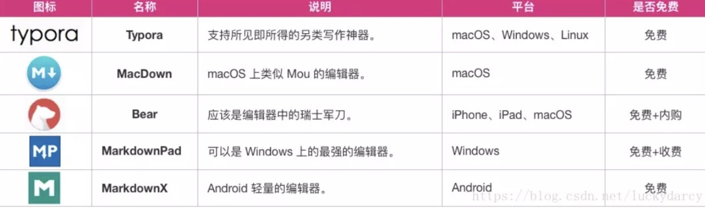
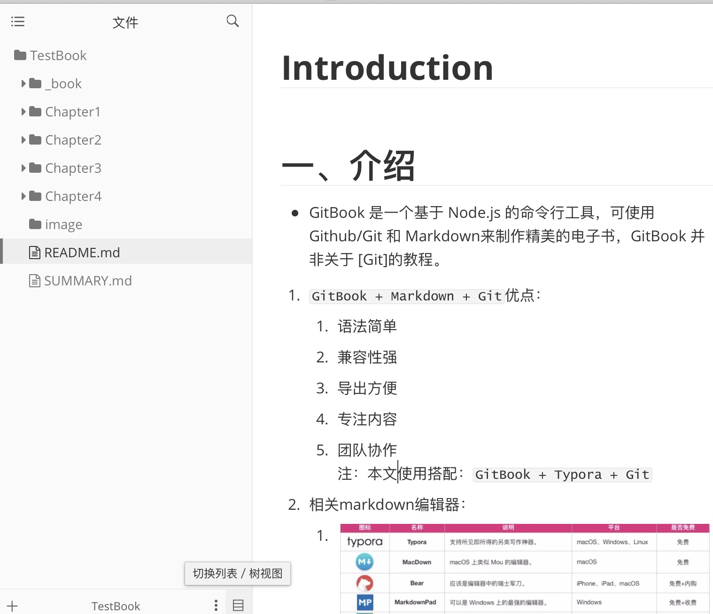
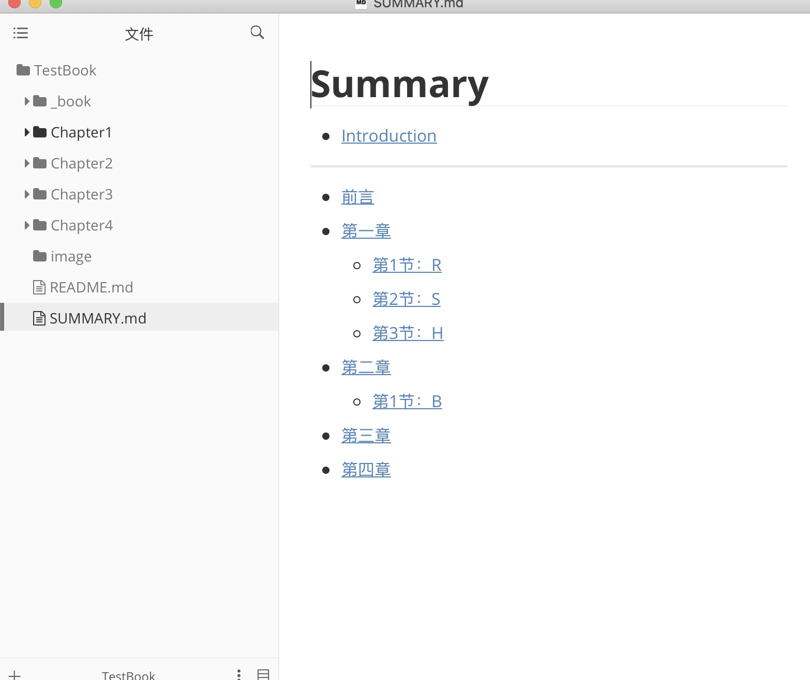

# Introduction


### 一、介绍

- GitBook 是一个基于 Node.js 的命令行工具，可使用 Github/Git 和 Markdown来制作精美的电子书，GitBook 并非关于 [Git]的教程。

1. `GitBook + Markdown + Git`优点：
   - 语法简单
   - 兼容性强
   - 导出方便
   - 专注内容
   - 团队协作
     注：本文使用搭配：`GitBook + Typora + Git`

2. 相关markdown编辑器：
   - 

### 二、安装

1. 全局安装gitbook-cli
   `npm i -g gitbook-cli`

2. 安装软件：Git、Typora

### 三、使用

1. 新建TestBook文件夹，初始化：gitbook init

   ```
   README.md —— 书籍的介绍写在这个文件里
   SUMMARY.md —— 书籍的目录结构在这里配置
   ```

2. 启动Typora编辑器，引入文件夹

   - 

3. 编辑SUMMARY.md

   ```
   # 目录
   * [前言](README.md)
   * [第一章](Chapter1/README.md)
     * [第1节：衣](Chapter1/衣.md)
     * [第2节：食](Chapter1/食.md)
     * [第3节：住](Chapter1/住.md)
     * [第4节：行](Chapter1/行.md)
   * [第二章](Chapter2/README.md)
   * [第三章](Chapter3/README.md)
   * [第四章](Chapter4/README.md)
   ```

4. 再次执行gitbook init，生成新目录结构

   - 

5. 浏览器浏览：gitbook serve

   - 执行 gitbook serve 来预览这本书籍，执行命令后会对 Markdown 格式的文档进行转换，默认转换为 html 格式，最后提示 “Serving book on http://localhost:4000”

6. 构建书籍：gitbook build

   - 默认：将生成的静态网站输出到 _book 目录
   - 指定路径：gitbook build [书籍路径] [输出路径]
   - 指定端口：gitbook serve --port 2333
   - 生成pdf格式：gitbook pdf ./ ./mybook.pdf
   - 生成epub格式：gitbook epub ./ ./mybook.epub
   - 生成 mobi 格式：gitbook mobi ./ ./mybook.mobi

- 注意：如果生成不了，你可能还需要安装一些工具，比如 calibre、ebook-convert，或者在 Typora 中安装 Pandoc 进行导出。

### 四、用 Git 做版本管理

- 在远端建好git仓库，在 mybook 目录下执行 git init 初始化仓库，执行 git remote add 添加远程仓库。接着就可以愉快地 commit，push，pull …